# 🎯 SSD — Single Shot Multibox Detection

> Complete illustrated walkthrough of the SSD object detection pipeline.

---

## Part 1 — Bounding Boxes & IoU

### What is a Bounding Box?

A bounding box is a rectangle that tightly encloses an object in an image.

**Two formats to describe a rectangle:**

**Corner format:** $(x_1, y_1, x_2, y_2)$ = top-left + bottom-right corners

**Center format:** $(c_x, c_y, w, h)$ = center point + width + height

### Converting Between Formats

$$c_x = \frac{x_1 + x_2}{2}, \quad c_y = \frac{y_1 + y_2}{2}$$

$$w = x_2 - x_1, \quad h = y_2 - y_1$$

<!-- pencil -->
↳ يعني ببساطة: إحنا بنوصف مكان الحاجة في الصورة — إما بالزوايا أو بالنص والعرض. نفس الفكرة بس طريقتين مختلفين.

---

### IoU — Intersection over Union

**Definition:** IoU measures overlap between two boxes. Range: 0 (no overlap) → 1 (perfect).

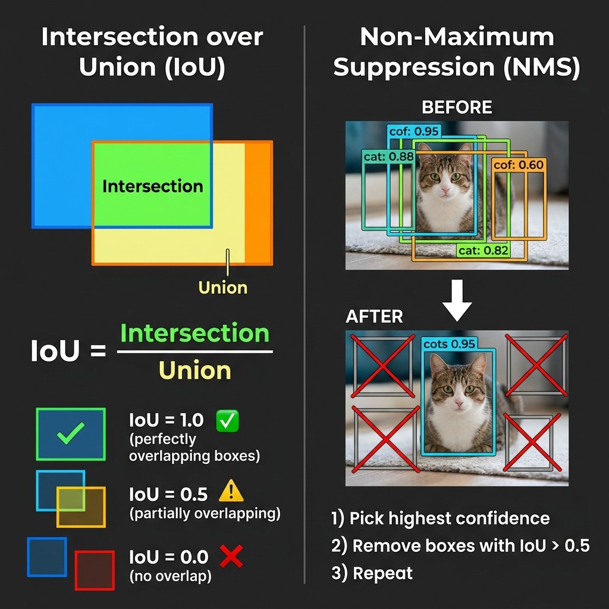

$$\text{IoU} = J(A, B) = \frac{|A \cap B|}{|A \cup B|}$$

**IoU ≥ 0.7** → Excellent match ✅

**IoU ≥ 0.5** → Acceptable (common threshold) ⚠️

**IoU < 0.5** → Poor match ❌

<!-- pencil -->
↳ IoU = قد إيه الصندوقين بيتداخلوا. لو 1 يبقى متطابقين، لو 0 يبقى مفيش أي overlap.

---

---
<br><br><br><br><br><br>

## Part 2 — NMS & Anchor Boxes

### NMS — Non-Maximum Suppression

**Problem:** The network generates thousands of boxes. Many detect the SAME object!

**Solution:** Keep only the most confident box per object.

### NMS Algorithm (3 Steps)

**Step 1:** Sort all boxes by confidence score (highest first)

**Step 2:** Take the highest box → KEEP it

**Step 3:** Remove all boxes with IoU > 0.5 with the kept box

**Repeat until no boxes remain.**

<!-- pencil -->
↳ NMS = فلتر. لو عندك 10 صناديق حوالين نفس العربية، خلي الأفضل وشيل الباقي.

---

### Anchor Boxes — Pre-defined Search Templates

**Definition:** Anchor boxes are pre-defined rectangles placed at every position in the feature map.

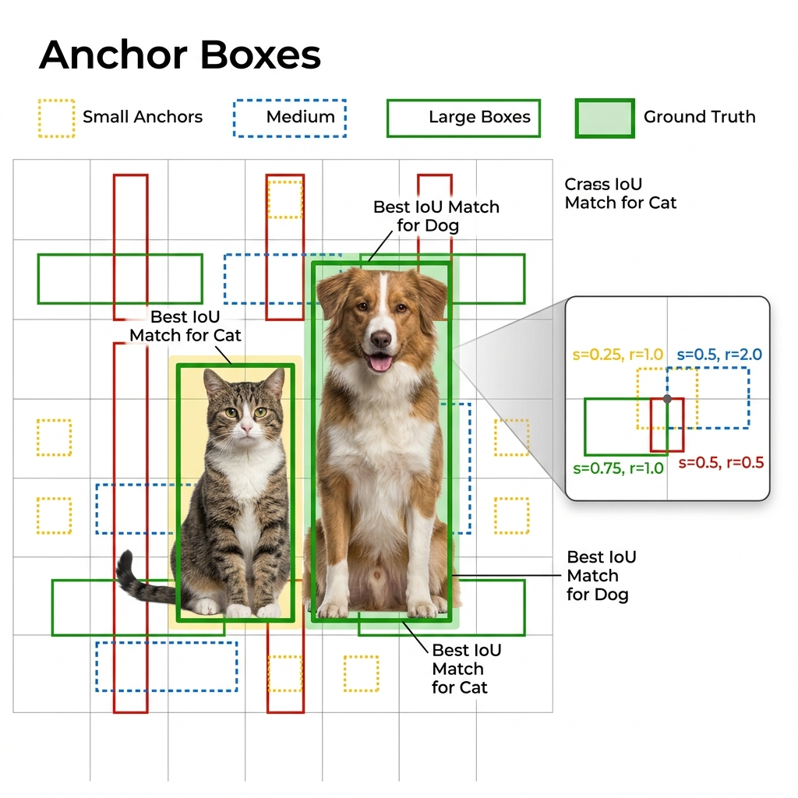

**Small square** ($s=0.25$, $r=1.0$): catches birds, traffic signs

**Medium square** ($s=0.50$, $r=1.0$): catches cats, chairs

**Wide rectangle** ($s=0.50$, $r=2.0$): catches cars, buses

**Tall rectangle** ($s=0.50$, $r=0.5$): catches standing people, poles

<!-- pencil -->
↳ Anchor Boxes = "براويز" جاهزة بأشكال مختلفة. بنجربهم كلهم على كل مكان في الصورة، واللي يتطابق مع الحقيقة بنحتفظ بيه.

---

---
<br><br><br><br><br><br>

## Part 3 — What is a Feature Map?

### The Most Important Question

What does "32×32×256" actually mean? Is it neural network nodes?

**NO!** It is a 3D block of numbers — like 256 heatmaps stacked together.

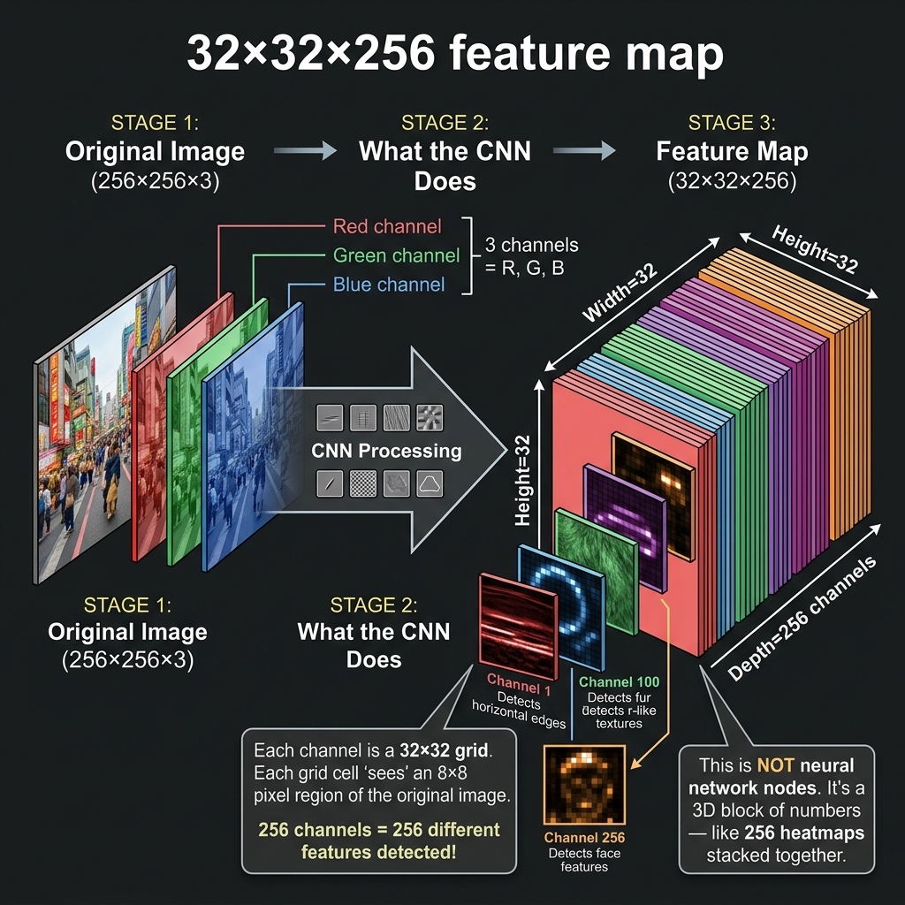

---

### The Original Image: 256×256×3

**256 × 256** = width and height in pixels

**× 3** = three color channels: Red, Green, Blue

Total: **196,608 numbers** (each between 0-255)

---

### After CNN Processing: 32×32×256

**32 × 32** = width and height are now 32 (8× smaller)

**× 256** = instead of 3 color channels, we have **256 learned feature channels**

---

### What Are Those 256 Channels?

Each channel is a **32×32 heatmap** showing where a specific pattern was detected:

**Channel 1:** Detects horizontal edges

**Channel 42:** Detects circular shapes

**Channel 100:** Detects fur textures

**Channel 200:** Detects car-like shapes

**Channel 256:** Detects face features

<!-- pencil -->
↳ الـ Feature Map مش nodes عادية. هي "كعكة" ثلاثية الأبعاد فيها 256 طبقة، كل طبقة بتقولك "فين الخطوط/الدواير/الأشكال؟". زي 256 خريطة حرارة فوق بعض.

> **Key insight:** Each cell in the 32×32 grid "sees" an 8×8 pixel region of the original image. The CNN trades spatial precision for semantic richness.

---

---
<br><br><br><br><br><br>

## Part 4 — SSD Architecture

### The Full SSD Pipeline

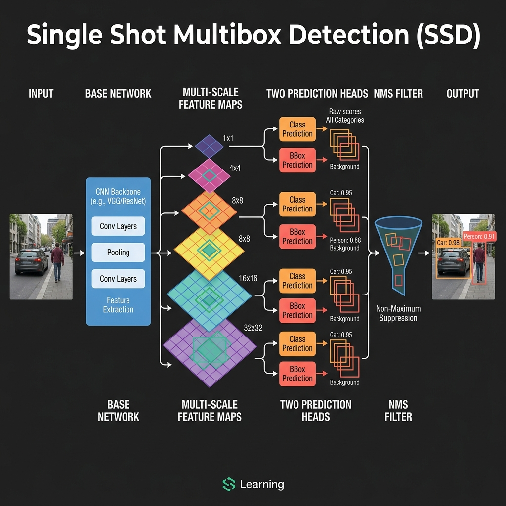

SSD has **5 components** that work like a factory assembly line.

---

### Component 1: Base Network (The "Eyes")

A pre-trained CNN (VGG-16) that converts the raw image into a feature map.

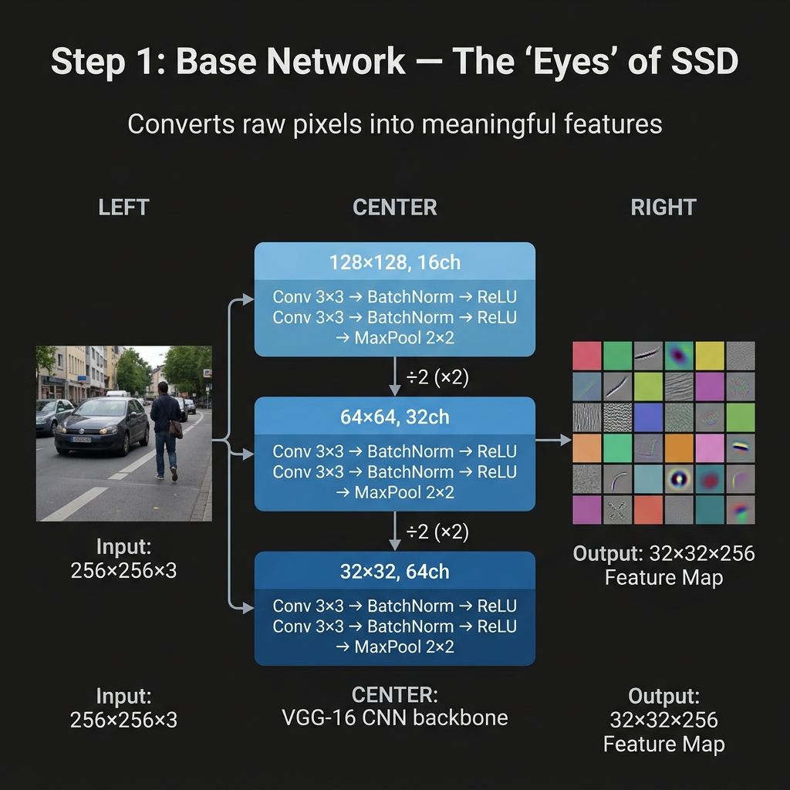

$$\underbrace{256 \times 256 \times 3}_{\text{Raw image}} \xrightarrow{\text{CNN}} \underbrace{32 \times 32 \times 256}_{\text{Feature map}}$$

---

### Inside a Downsampling Block

Each block runs this pipeline:

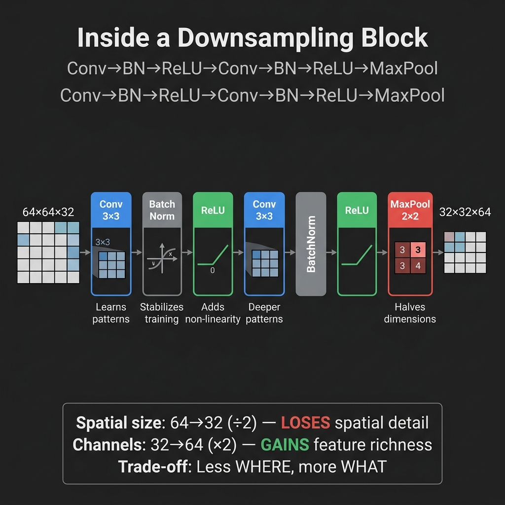

```
Conv 3×3 → BatchNorm → ReLU → Conv 3×3 → BatchNorm → ReLU → MaxPool 2×2
```

<!-- pencil -->
↳ كود الـ Block ده: كل خطوة بتاخد الصورة وتمررها على فلاتر (Conv)، تنورملها (BN)، تفعلها (ReLU)، بعدين تصغرها (MaxPool). الصورة بتصغر في المساحة بس بتكبر في العمق.

**The 3 blocks progressively transform the image:**

**Block 1:** $256 \times 256 \times 3 → 128 \times 128 \times 16$ (edges detected)

**Block 2:** $128 \times 128 \times 16 → 64 \times 64 \times 32$ (shapes detected)

**Block 3:** $64 \times 64 \times 32 → 32 \times 32 \times 64$ (objects detected)

> **Key insight:** Spatial size halves (÷2) but channels double (×2). We lose "WHERE" but gain "WHAT."

---

### Component 2: Multi-Scale Feature Maps

After the base network, additional blocks shrink the feature map. Each scale detects objects of a different size.

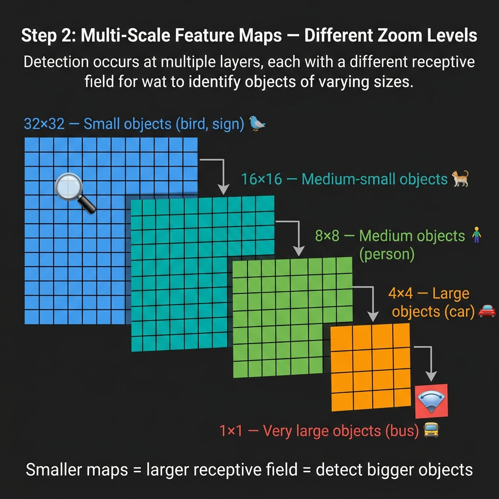

**Scale 1:** $32 \times 32$ → 🐦 Small objects (bird, sign)

**Scale 2:** $16 \times 16$ → 🐱 Medium-small objects

**Scale 3:** $8 \times 8$ → 🚶 Medium objects (person)

**Scale 4:** $4 \times 4$ → 🚗 Large objects (car)

**Scale 5:** $1 \times 1$ → 🚌 Very large objects (bus)

<!-- pencil -->
↳ زي 5 كاميرات أمان بزوم مختلف — كاميرا قريبة للتفاصيل الصغيرة وكاميرا بانوراما للمشهد الكامل.

---

---
<br><br><br><br><br><br>

## Part 5 — Prediction Layers (Code Deep Dive)

### Class Prediction Layer

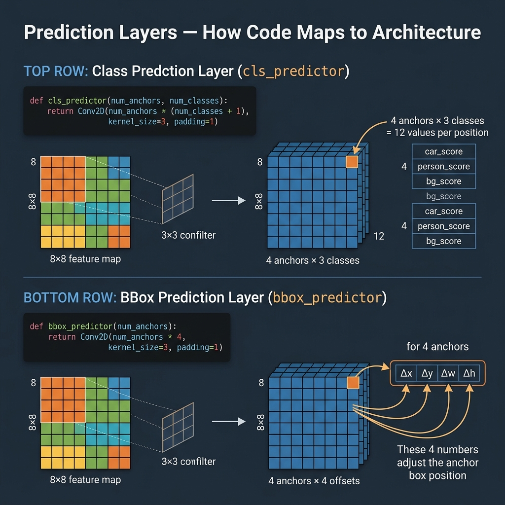

**`cls_predictor` — "What's inside each anchor?"**

**What this function does:** It creates a convolutional layer that looks at each cell in the feature map and outputs class scores for every anchor box at that cell.

**Why Conv2D?** Because we want to slide the same detector across the entire feature map — convolution does exactly that.

**Why `kernel_size=3`?** The detector looks at a 3×3 neighborhood (the cell + its 8 neighbors) to make a decision.

**Why `padding=1`?** So the output feature map has the same width/height as the input.

```python
def cls_predictor(num_anchors, num_classes):
    return nn.Conv2D(
        num_anchors * (num_classes + 1),
        kernel_size=3, padding=1
    )
```

**Line-by-line breakdown:**

`def cls_predictor(num_anchors, num_classes):` → Factory function that builds one prediction layer

`return nn.Conv2D(` → Creates a 2D convolutional layer (a sliding detector)

`num_anchors * (num_classes + 1),` → Output channels = anchors × (classes + background)

`kernel_size=3, padding=1` → 3×3 window, padding keeps dimensions unchanged

<!-- pencil -->
↳ الفكرة: عندنا مثلاً 4 أنكور في كل خلية، و 2 كلاس (عربية + شخص) + 1 خلفية = 3. يبقى الناتج = 4 × 3 = 12 قيمة لكل خلية.

<!-- pencil -->
↳ الـ Conv2D بتشتغل زي "عين" بتبص على كل مكان في الـ feature map وبتقول: "الأنكور ده فيه إيه؟ عربية؟ شخص؟ ولا فاضي؟"

**Example with real numbers:**

If $\text{num\_anchors} = 4$ and $\text{num\_classes} = 2$:

$$\text{output channels} = 4 \times (2 + 1) = 4 \times 3 = 12$$

Each cell outputs 12 numbers: 4 anchors × 3 class scores each.

---

### BBox Prediction Layer

**`bbox_predictor` — "How should each anchor box be adjusted?"**

**What this function does:** For each anchor, it predicts 4 offset values that tell us how to shift and resize the anchor to fit the actual object.

**The 4 offsets explained:**

$\Delta x$ → Move the center left/right

$\Delta y$ → Move the center up/down

$\Delta w$ → Make the box wider/narrower

$\Delta h$ → Make the box taller/shorter

```python
def bbox_predictor(num_anchors):
    return nn.Conv2D(
        num_anchors * 4,
        kernel_size=3, padding=1
    )
```

**Line-by-line breakdown:**

`def bbox_predictor(num_anchors):` → Only needs anchor count (no classes — this is just geometry)

`return nn.Conv2D(` → Same sliding-window approach as cls_predictor

`num_anchors * 4,` → Each anchor needs exactly 4 adjustment values

`kernel_size=3, padding=1` → Same 3×3 window, same padding logic

<!-- pencil -->
↳ الفرق عن cls_predictor: هنا مش بنسأل "فيه إيه؟" — بنسأل "الصندوق لازم يتحرك فين؟". كل أنكور محتاج 4 أرقام بس: حركه يمين/شمال، فوق/تحت، كبّره/صغّره.

<!-- pencil -->
↳ يعني لو 4 أنكور: الناتج = 4 × 4 = 16 قيمة لكل خلية في الـ feature map.

---

### The Downsampling Block Code

**`down_sample_blk` — Building block of the base network**

**What this function does:** Takes a feature map and makes it SMALLER (half width, half height) but DEEPER (more channels). This is how the CNN "zooms out."

```python
def down_sample_blk(num_channels):
    blk = []
    for _ in range(2):
        blk.append(nn.Conv2D(num_channels, kernel_size=3, padding=1))
        blk.append(nn.BatchNorm())
        blk.append(nn.Activation('relu'))
    blk.append(nn.MaxPool2D(2))
    return nn.Sequential(*blk)
```

**Line-by-line breakdown:**

`def down_sample_blk(num_channels):` → Creates a block that outputs `num_channels` features

`blk = []` → Start with an empty list of layers

`for _ in range(2):` → Repeat the next 3 layers TWICE (two conv-BN-ReLU passes)

`blk.append(nn.Conv2D(num_channels, kernel_size=3, padding=1))` → 3×3 filter detects patterns

`blk.append(nn.BatchNorm())` → Normalize values to prevent exploding/vanishing gradients

`blk.append(nn.Activation('relu'))` → Keep only positive values (add non-linearity)

`blk.append(nn.MaxPool2D(2))` → Shrink spatial size by 2× (keep strongest activations)

`return nn.Sequential(*blk)` → Chain all 7 layers into one sequential block

<!-- pencil -->
↳ الـ Block ده بيعمل حاجتين: (1) بيفهم الصورة أحسن بالـ Conv + ReLU، (2) بيصغّرها بالـ MaxPool. زي ما تبص على صورة من بعيد — بتفقد التفاصيل بس بتفهم الصورة الكبيرة.

<!-- pencil -->
↳ ليه BatchNorm؟ عشان الأرقام متكبرش أوي أو تصغر أوي — بتخلي التدريب أسرع وأثبت. زي ما تظبط الصوت قبل ما تسجل.

---

### Anchor Box Generation — Total Count

$$\text{Total anchors} = (32^2 + 16^2 + 8^2 + 4^2 + 1^2) \times 4 = \mathbf{5{,}460}$$

**Scale 1:** $32 \times 32 = 1{,}024$ cells × 4 = 4,096

**Scale 2:** $16 \times 16 = 256$ cells × 4 = 1,024

**Scale 3:** $8 \times 8 = 64$ cells × 4 = 256

**Scale 4:** $4 \times 4 = 16$ cells × 4 = 64

**Scale 5:** $1 \times 1 = 1$ cell × 4 = 4

<!-- green -->
**TOTAL = 5,460 anchor boxes!** ✅

<!-- pencil -->
↳ كل ما الـ feature map تصغر، الأنكور بوكسات بتقل — بس كل أنكور بيغطي مساحة أكبر من الصورة الأصلية.

---

---
<br><br><br><br><br><br>

## Part 6 — Concatenation & Training

### The Problem: Different Shapes from Different Scales

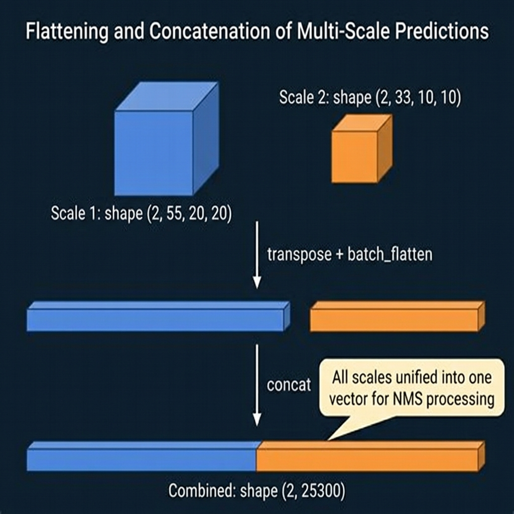

Scale 1 outputs shape $(2, 44, 32, 32)$ — Scale 2 outputs $(2, 44, 16, 16)$

**Problem:** You can't stack arrays of different sizes!

**Solution:** Flatten each to a 1D vector, then concatenate.

---

### flatten_pred — Reshaping One Scale's Output

**What this function does:** Takes a 4D tensor (batch, channels, H, W) and flattens it to 2D (batch, everything_else).

**Why transpose first?** The channels dimension needs to move to the end so that each cell's predictions stay together after flattening.

```python
def flatten_pred(pred):
    return npx.batch_flatten(
        pred.transpose(0, 2, 3, 1)
    )
```

**Line-by-line breakdown:**

`def flatten_pred(pred):` → Input: a prediction tensor from one scale

`pred.transpose(0, 2, 3, 1)` → Reorder: (batch, channels, H, W) → (batch, H, W, channels)

`npx.batch_flatten(...)` → Flatten H × W × channels into one long vector per batch

<!-- pencil -->
↳ تخيل عندك رف كتب فيه طوابق (H) × أعمدة (W) × كتب في كل مكان (channels). الـ transpose بيرتب الكتب، والـ flatten بيحطهم كلهم في صف واحد.

---

### concat_preds — Unifying All Scales

```python
def concat_preds(preds):
    return np.concatenate(
        [flatten_pred(p) for p in preds],
        axis=1
    )
```

**Line-by-line breakdown:**

`def concat_preds(preds):` → Input: a list of predictions from ALL scales

`[flatten_pred(p) for p in preds]` → Flatten each scale's output individually

`np.concatenate(..., axis=1)` → Glue all flattened vectors end-to-end

<!-- pencil -->
↳ كل scale بيطلع ڤيكتور مختلف الطول. الـ concatenate بيلزقهم في سطر واحد طويل — كده كل الـ predictions من كل الـ scales في مكان واحد!

---

### Testing the Shapes — Real Example

```python
Y1 = forward(np.zeros((2, 8, 20, 20)), cls_predictor(5, 10))
Y2 = forward(np.zeros((2, 16, 10, 10)), cls_predictor(3, 10))
```

**Line-by-line breakdown:**

`np.zeros((2, 8, 20, 20))` → Fake input: batch=2, 8 channels, 20×20 grid

`cls_predictor(5, 10)` → 5 anchors, 10 classes → outputs 5×11 = 55 channels

`Y1.shape = (2, 55, 20, 20)` → 55 channels on a 20×20 grid

`Y2.shape = (2, 33, 10, 10)` → 33 channels on a 10×10 grid

```python
concat_preds([Y1, Y2]).shape
# Output: (2, 25300)  →  All unified!
```

<!-- pencil -->
↳ الحساب: Y1 فيها 55 × 20 × 20 = 22,000 قيمة. Y2 فيها 33 × 10 × 10 = 3,300 قيمة. المجموع = 25,300 في ڤيكتور واحد!

---

### The Training Loop — How SSD Learns

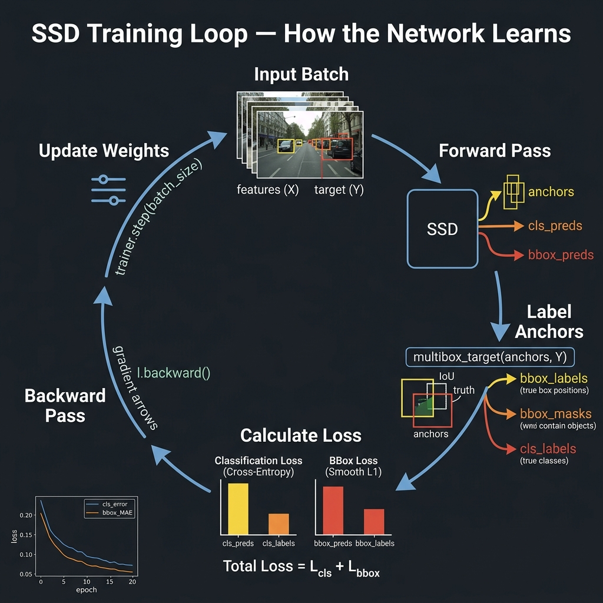

**The training process has 5 phases per image:**

**Phase 1:** Feed image through the network → get predictions

**Phase 2:** Match anchors to ground truth boxes (multibox_target)

**Phase 3:** Calculate loss (how wrong are we?)

**Phase 4:** Backpropagate (find which weights to blame)

**Phase 5:** Update weights (fix the mistakes)

```python
for epoch in range(num_epochs):
    for features, target in train_iter:
        X = features.as_in_ctx(device)
        Y = target.as_in_ctx(device)
```

`for epoch in range(num_epochs):` → Repeat the entire training dataset num_epochs times

`for features, target in train_iter:` → Get one batch of images + their ground truth boxes

`X = features.as_in_ctx(device)` → Move images to GPU for fast computation

`Y = target.as_in_ctx(device)` → Move ground truth labels to GPU

```python
        with autograd.record():
            anchors, cls_preds, bbox_preds = net(X)
            bbox_labels, bbox_masks, cls_labels = \
                d2l.multibox_target(anchors, Y)
            l = calc_loss(cls_preds, cls_labels,
                         bbox_preds, bbox_labels, bbox_masks)
        l.backward()
        trainer.step(batch_size)
```

`with autograd.record():` → "Record mode" — track all operations for gradient calculation

`anchors, cls_preds, bbox_preds = net(X)` → Forward pass: get all 3 outputs from SSD

`d2l.multibox_target(anchors, Y)` → Match each anchor to its closest ground truth box

`calc_loss(...)` → Compare predictions vs reality → get error number

`l.backward()` → Backpropagation: compute gradient of loss w.r.t. every weight

`trainer.step(batch_size)` → Update all weights: $w \leftarrow w - \eta \cdot \nabla \mathcal{L}$

<!-- pencil -->
↳ الـ training بيمشي كده: (1) أدخل الصورة في الشبكة، (2) أطلع الـ predictions، (3) قارن بالحقيقة عشان أعرف غلطت فين، (4) احسب الخسارة، (5) عدّل الأوزان عشان المرة الجاية يكون أدق.

<!-- pencil -->
↳ الـ multibox_target هي اللي بتربط كل أنكور بأقرب ground truth box. الأنكور اللي IoU بتاعه عالي مع صندوق حقيقي → يبقى positive. الباقي → negative (خلفية).

---

### The Loss Function

$$\mathcal{L} = \underbrace{\mathcal{L}_{\text{cls}}}_{\text{Classification}} + \lambda \cdot \underbrace{\mathcal{L}_{\text{bbox}}}_{\text{Bounding Box}}$$

**$\mathcal{L}_{\text{cls}}$** = Cross-Entropy Loss → "Did you predict the right class?"

**$\mathcal{L}_{\text{bbox}}$** = Smooth L1 Loss → "Did you predict the right box position?"

<!-- pencil -->
↳ الخسارة الكلية = خسارة التصنيف (غلطت في الكلاس؟) + خسارة الصندوق (الصندوق مش في مكانه؟). لازم الاتنين يقلوا عشان الشبكة تتحسن.

---

---
<br><br><br><br><br><br>

## Part 7 — SSD in Action (Worked Example)

### Input: A Street Photo

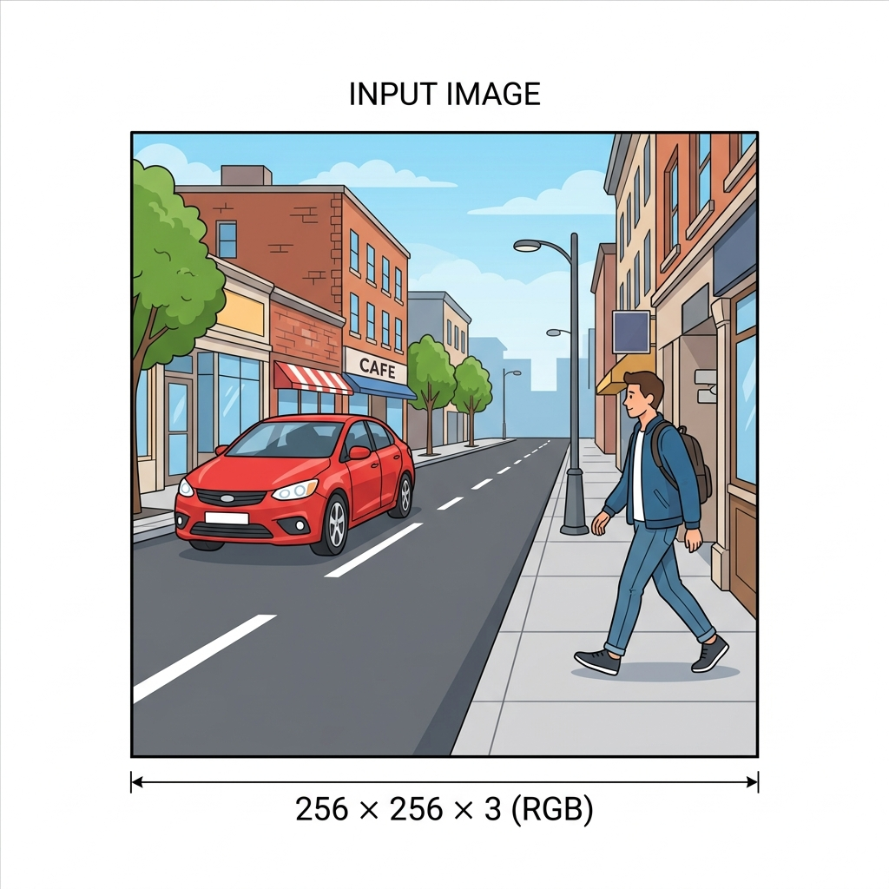

A $256 \times 256 \times 3$ photo with a **car** and a **person**. Total: **196,608 raw numbers**.

---

### Step 1 — Base Network


VGG-16 processes through 3 blocks → $32 \times 32 \times 256$ feature map.

<!-- pencil -->
↳ الشبكة شافت الصورة وفهمت فيها إيه — حواف، أشكال، textures. دلوقتي بقى عندها "فهم" مش بكسلات.

---

### Step 2 — Multi-Scale Feature Maps


3 more blocks + 1 global pool → 5 scales: $32^2 → 16^2 → 8^2 → 4^2 → 1^2$

---

### Step 3 — Anchor Generation

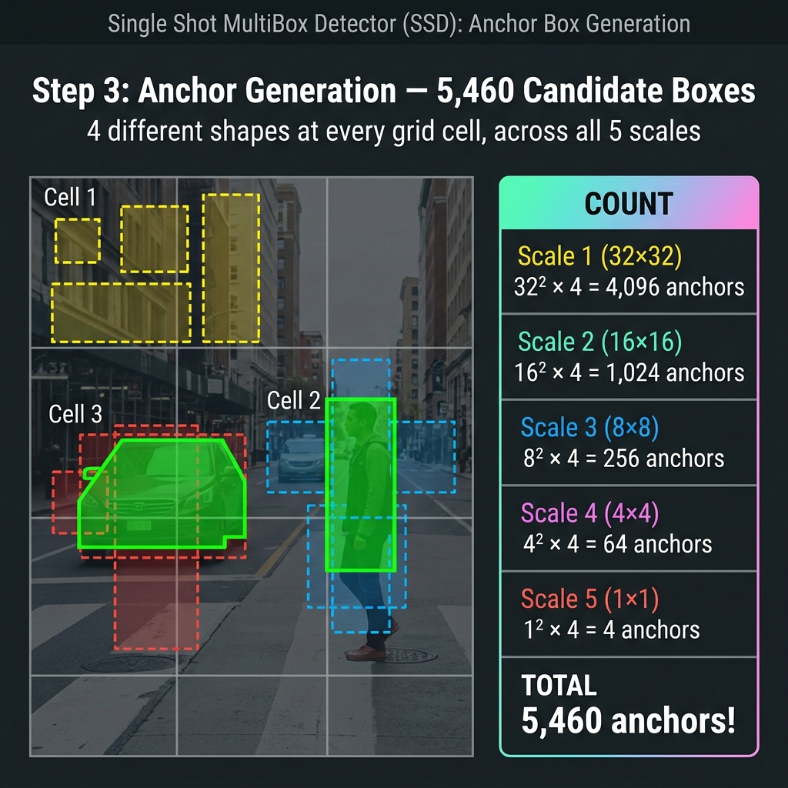

4 anchors per cell × all cells across 5 scales = **5,460 anchor boxes**.

---

### Step 4 — Class Prediction

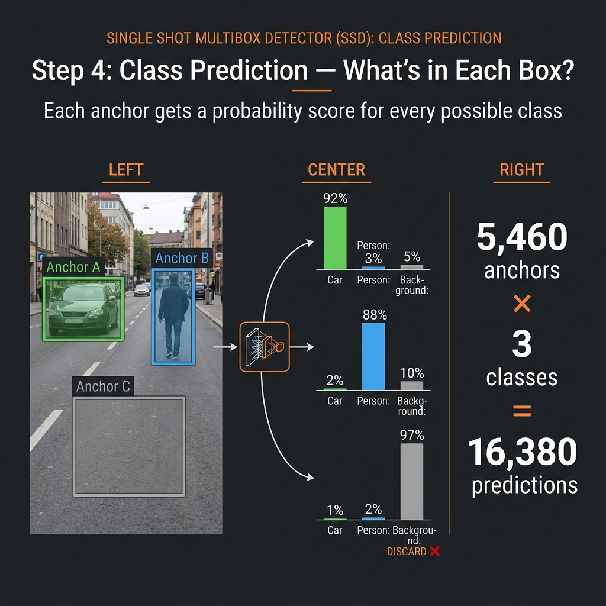

Each anchor → 3 class scores. Total: $5{,}460 \times 3 = \mathbf{16{,}380}$ predictions.

---

### Step 5 — BBox Prediction

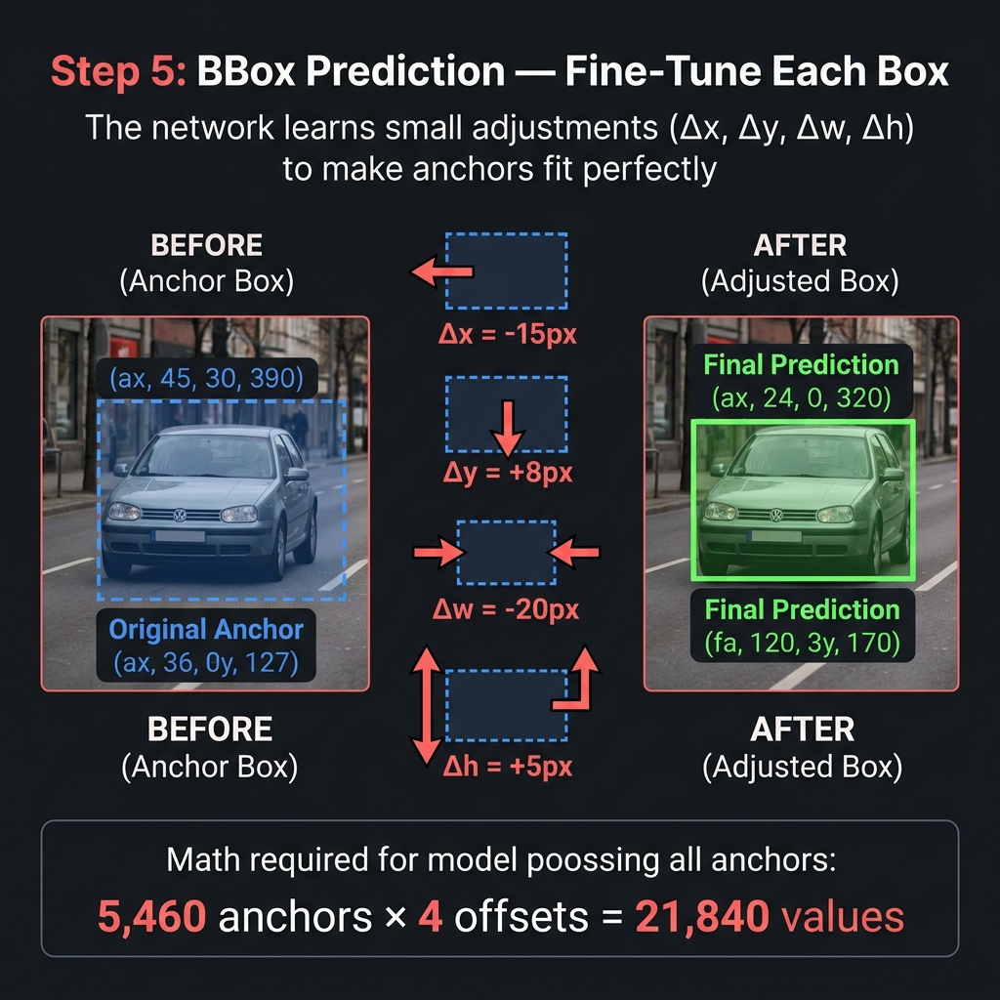

Each anchor → 4 offsets ($\Delta x, \Delta y, \Delta w, \Delta h$). Total: $5{,}460 \times 4 = \mathbf{21{,}840}$ values.

---

### Step 6 — NMS Filtering

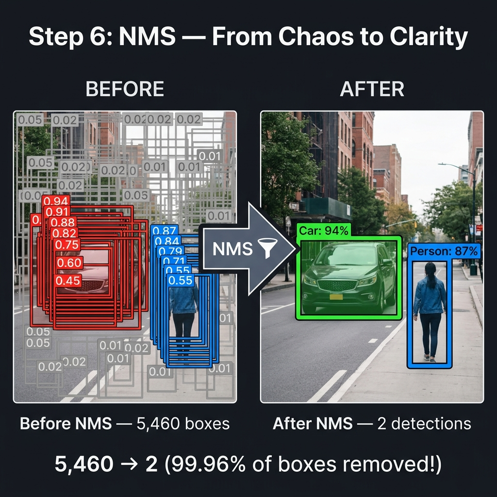

NMS sorts by confidence → keeps the best → removes duplicates.

<!-- green -->
**5,460 → 2 boxes** (99.96% removed!) ✅

---

### Final Output

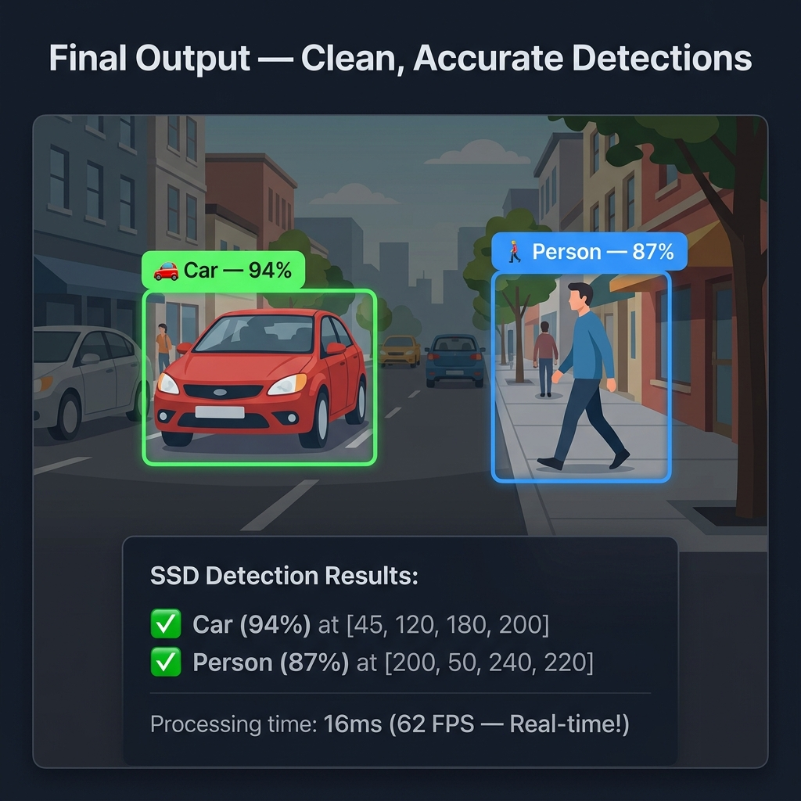

📦 **Box 1:** 🚗 Car — confidence **94%** — position $(45, 120, 180, 200)$

📦 **Box 2:** 🚶 Person — confidence **87%** — position $(200, 50, 240, 220)$

> **The full journey:** 196,608 pixels → 5,460 anchors → 16,380 scores → 21,840 offsets → NMS → **2 clean detections**

---

---
<br><br><br><br><br><br>

## Part 8 — SSD vs R-CNN Family

### Inference Code — Using SSD After Training

**Step 1: Prepare the image (preprocessing)**

```python
img = image.imread('../img/banana.jpg')
feature = image.imresize(img, 256, 256).astype('float32')
X = np.expand_dims(feature.transpose(2, 0, 1), axis=0)
```

**Line-by-line breakdown:**

`image.imread('../img/banana.jpg')` → Load image from disk as a pixel array (H, W, 3)

`image.imresize(img, 256, 256)` → Resize to 256×256 (SSD expects fixed input size)

`.astype('float32')` → Convert pixel values from integers (0-255) to floats

`feature.transpose(2, 0, 1)` → Reorder from (H, W, C) → (C, H, W) — PyTorch/MXNet format

`np.expand_dims(..., axis=0)` → Add batch dimension: (C, H, W) → (1, C, H, W)

<!-- pencil -->
↳ الشبكة بتتوقع الصورة بشكل معين: (1, 3, 256, 256) — يعني batch واحد، 3 ألوان، 256×256. لازم نحوّل الصورة للشكل ده قبل ما ندخلها.

---

### Step 2: The predict function

```python
def predict(X):
    anchors, cls_preds, bbox_preds = net(X.as_in_ctx(device))
    cls_probs = npx.softmax(cls_preds).transpose(0, 2, 1)
    output = d2l.multibox_detection(cls_probs, bbox_preds, anchors)
    idx = [i for i, row in enumerate(output[0]) if row[0] != -1]
    return output[0, idx]
```

**Line-by-line breakdown:**

`net(X.as_in_ctx(device))` → Forward pass: send image through the trained SSD → get anchors, class predictions, box predictions

`npx.softmax(cls_preds)` → Convert raw scores to probabilities (all sum to 1 per anchor)

`.transpose(0, 2, 1)` → Rearrange dimensions so multibox_detection can read them

`d2l.multibox_detection(...)` → Apply NMS: filter overlapping boxes, keep only the best

`row[0] != -1` → Filter out background detections (class -1 = "nothing here")

`output[0, idx]` → Return only the real detections

<!-- pencil -->
↳ الـ softmax بيحوّل الأرقام الخام لاحتمالات. مثلاً: [2.1, 0.5, -1.3] → [0.82, 0.15, 0.03]. الرقم الأكبر بيبقى الاحتمال الأعلى.

<!-- pencil -->
↳ الـ multibox_detection بتعمل NMS (شيل الصناديق المكررة) وترجّع لكل صندوق: [class_id, confidence, x1, y1, x2, y2]. لو class_id = -1 يبقى خلفية ومش عايزينه.

---

### Architecture Comparison

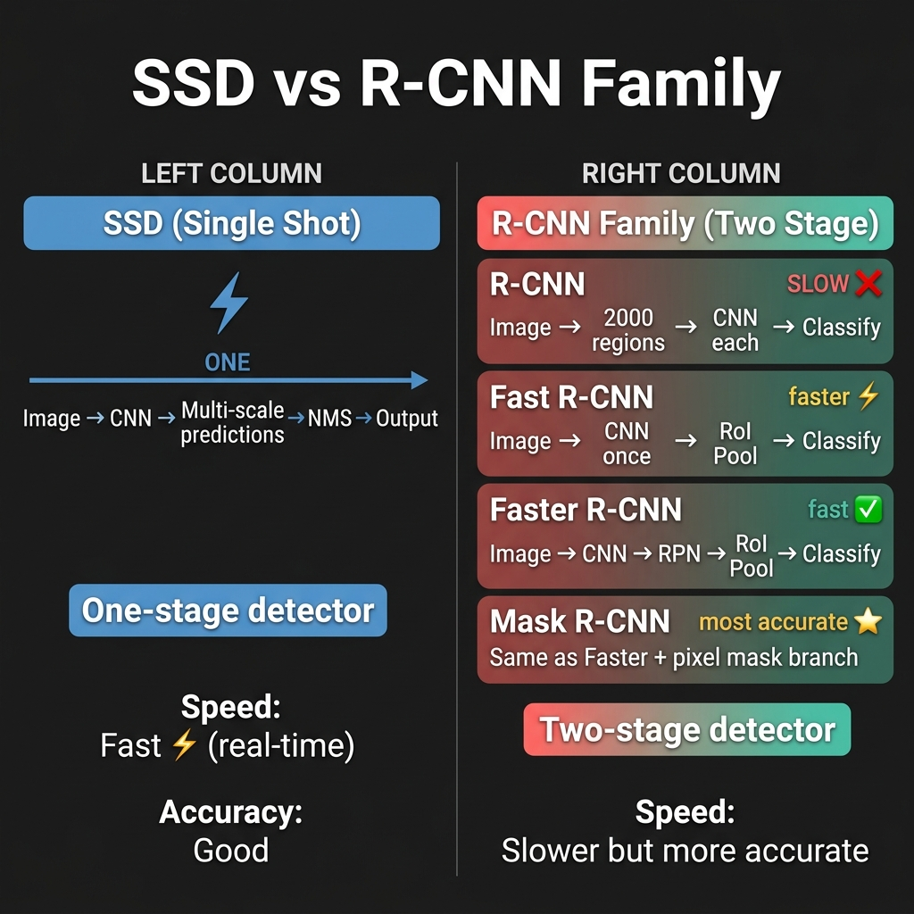

**SSD:** 1 stage, ~59 FPS (real-time) ⚡

**R-CNN:** 2 stages, ~0.05 FPS (20 seconds per image!) 🐌

**Fast R-CNN:** 2 stages, 1 CNN pass + RoI Pooling 🏃

**Faster R-CNN:** 2 stages, learned proposals via RPN 🚀

**Mask R-CNN:** 2 stages, adds pixel-level segmentation 🎭

---

### Quick Decision Guide

**Need real-time detection?** → Use SSD ⚡

**Need highest box accuracy?** → Use Faster R-CNN 🎯

**Need pixel-level masks?** → Use Mask R-CNN 🎭

### Key Formulas to Remember

$$\text{IoU} = \frac{|A \cap B|}{|A \cup B|}$$

$$\text{Total Anchors} = \sum_{\text{scales}} (H_i \times W_i) \times k$$

$$\mathcal{L} = \mathcal{L}_{\text{cls}} + \lambda \cdot \mathcal{L}_{\text{bbox}}$$

<!-- pencil -->
↳ كده خلصنا SSD من الصفر! الخلاصة: SSD بيعمل كل حاجة في forward pass واحد — anchors + class scores + box offsets + NMS → detections. السرعة هي الميزة الكبيرة.
