# 🎯 R-CNN Family — From Slow Proposals to Real-Time Detection

> Complete illustrated walkthrough of the R-CNN evolution: R-CNN → Fast R-CNN → Faster R-CNN → Mask R-CNN. Understanding the "two-stage" approach to object detection.

---

## Part 1 — The Big Picture: Two-Stage Detection

### What Problem Are We Solving?

Object detection = **Where** is the object + **What** is the object.

Unlike image classification (one label for the whole image), detection must output **multiple bounding boxes** with class labels.

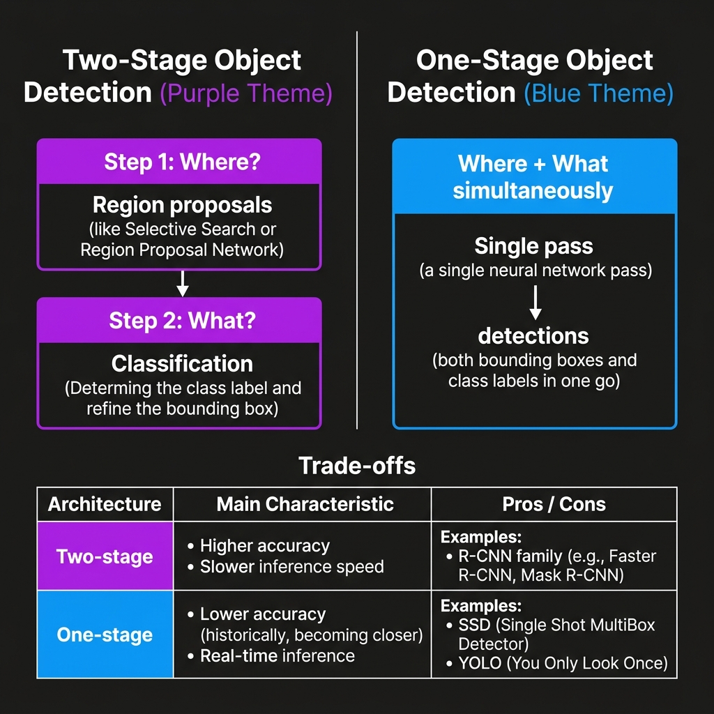

**Two-stage detectors** (R-CNN family) split the problem:

**Stage 1:** "Where might objects be?" → generate region proposals

**Stage 2:** "What is in each region?" → classify each proposal

<!-- pencil -->
↳ فكر فيها كده: الـ Two-Stage زي ما حد يدور في الأول على الأماكن اللي ممكن يكون فيها حاجة (Stage 1)، وبعدين يبص على كل مكان ويقول "ده إيه؟" (Stage 2). بطيء بس دقيق.

---

### The R-CNN Family Timeline

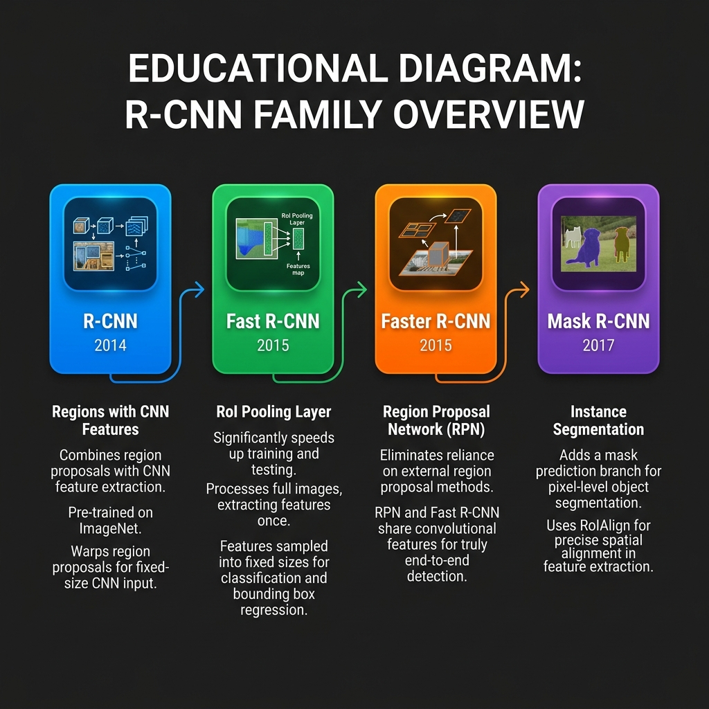

**R-CNN (2014)** — The pioneer. Proved CNNs beat handcrafted features. But painfully slow: **47 seconds per image** 🐌

**Fast R-CNN (2015)** — Fixed the redundant CNN passes. Down to **2.3 seconds** 🏃

**Faster R-CNN (2015)** — Replaced Selective Search with a learned RPN. Down to **0.2 seconds** 🚀

**Mask R-CNN (2017)** — Added pixel-level masks. Instance segmentation! 🎭

<!-- pencil -->
↳ كل نسخة جديدة بتحل مشكلة النسخة اللي قبلها. R-CNN كان بطيء عشان بيعدي كل region لوحدها. Fast R-CNN حلها بـ CNN واحد. Faster R-CNN شال الـ Selective Search. Mask R-CNN ضاف segmentation.

> **Key insight:** Each version keeps the two-stage philosophy but makes one component faster or more capable.

---

---
<br><br><br><br><br><br>

## Part 2 — R-CNN: The Original (Girshick et al., 2014)

### The R-CNN Pipeline

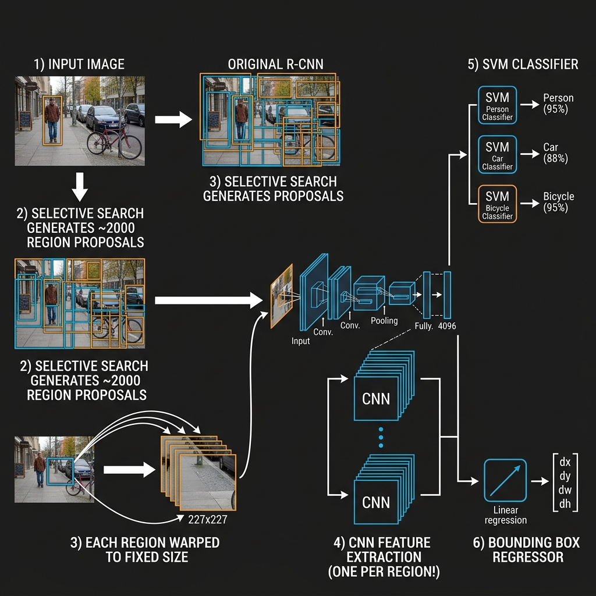

**Step 1:** Run Selective Search → ~2000 region proposals

**Step 2:** Warp each region to 227×227 pixels

**Step 3:** Run each warped region through a CNN (AlexNet) → 4096-dim feature vector

**Step 4:** Classify with SVM + refine box with linear regressor

<!-- pencil -->
↳ الـ R-CNN بيقطع الصورة لـ 2000 قطعة، وكل قطعة بيدخلها CNN لوحدها. تخيل إنك بتطبخ 2000 طبق واحد واحد بدل ما تطبخهم كلهم مع بعض!

---

### Selective Search — How Proposals Are Generated

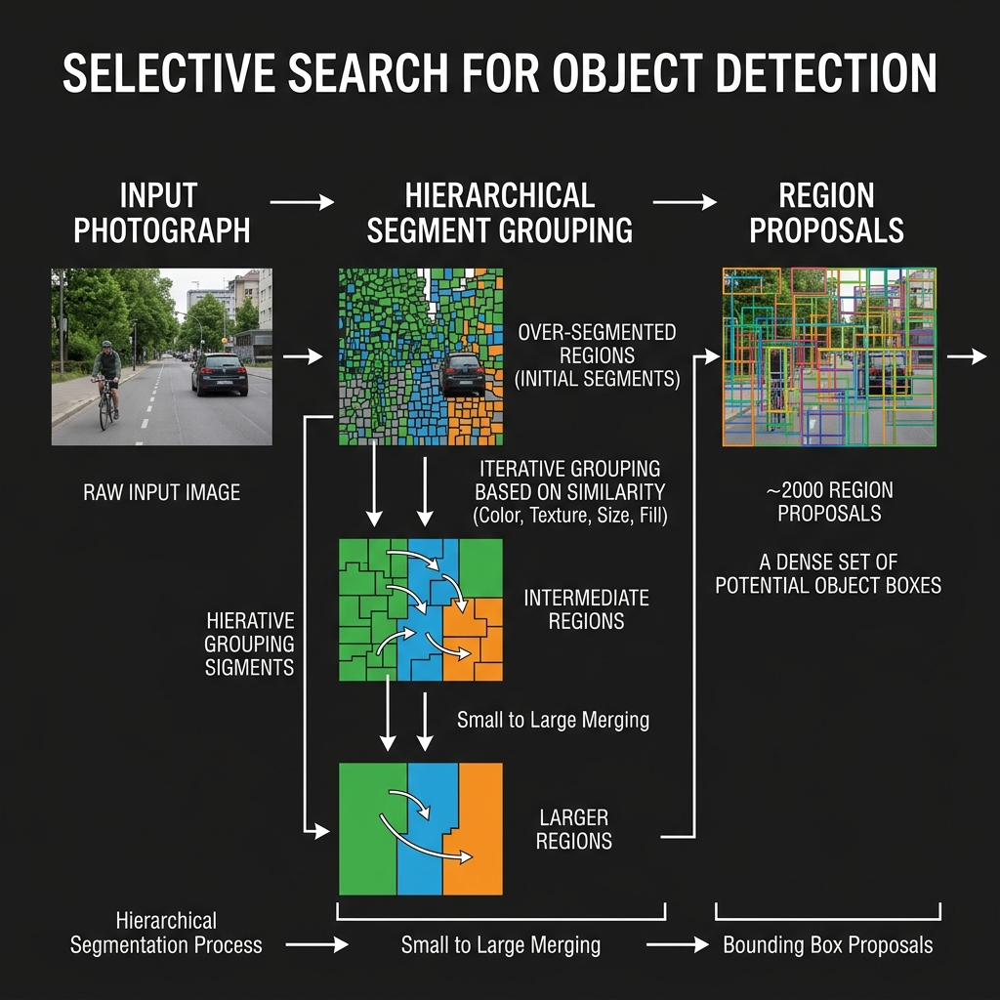

**How it works:**

**Step 1:** Over-segment the image into ~2000 small regions (superpixels)

**Step 2:** Compute similarity between neighboring regions (color, texture, size)

**Step 3:** Greedily merge the two most similar regions

**Step 4:** Repeat until the entire image is one region

**Step 5:** Collect all bounding boxes from the hierarchy → ~2000 proposals

<!-- pencil -->
↳ الـ Selective Search بيبدأ بتقسيم الصورة لحتت صغيرة، وبعدين يلزقهم مع بعض واحدة واحدة. كل مرة بيلزق اتنين، بيسجل الـ bounding box بتاعهم. في الآخر عنده ~2000 مقترح.

---

### The Bottleneck — Why R-CNN is Slow

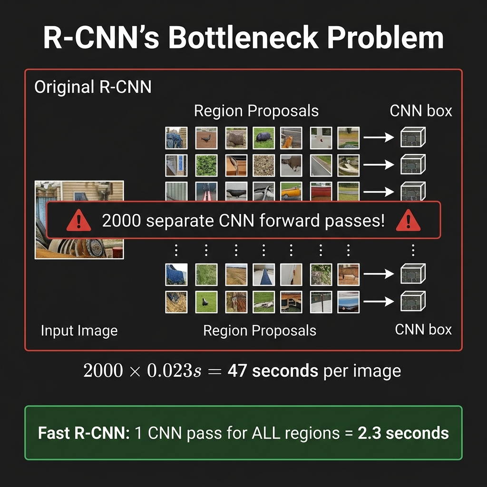

**The math is brutal:**

$$\text{Total time} = N_{\text{proposals}} \times t_{\text{CNN}} = 2000 \times 0.023\text{s} = 47\text{s}$$

**Per image!** That's 0.02 FPS. Completely unusable for video.

<!-- pencil -->
↳ المشكلة: كل region proposal بتحتاج forward pass كامل في الـ CNN. يعني 2000 مرة نفس الشغل! ده زي ما تكون بتكتب الامتحان 2000 مرة بدل مرة واحدة.

<!-- green -->
**Problem identified: redundant computation.** The same image pixels are processed thousands of times through the CNN! ✅

---

### R-CNN Training — Multi-Stage Nightmare

Training R-CNN is also painful — **3 separate stages:**

**Stage 1:** Pre-train CNN on ImageNet (classification)

**Stage 2:** Fine-tune CNN on detection data

**Stage 3:** Train SVM classifiers (one per class)

**Stage 4:** Train bounding box regressors

<!-- red -->
**Each stage requires separate storage of features on disk!** 💾

<!-- pencil -->
↳ التدريب كمان متعب! 3 مراحل منفصلة، كل واحدة ليها optimizer مختلف. ده زي ما تبني 3 مشاريع بدل مشروع واحد.

> **Key insight:** R-CNN proved that CNNs + region proposals = powerful detection. But the architecture is a Frankenstein of separate components that don't train end-to-end.

---

---
<br><br><br><br><br><br>

## Part 3 — Fast R-CNN: One CNN to Rule Them All

### The Key Insight

**Instead of running the CNN 2000 times** (once per proposal)...

**Run the CNN ONCE on the entire image**, then extract features for each proposal from the shared feature map!

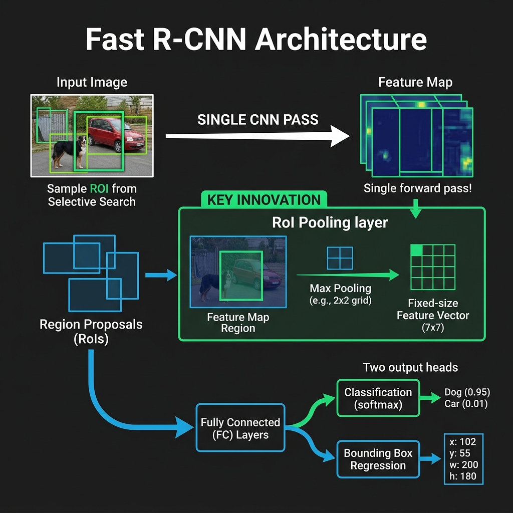

**The pipeline:**

**Step 1:** Entire image → CNN → shared feature map

**Step 2:** Project each proposal onto the feature map

**Step 3:** RoI Pooling → fixed-size feature for each proposal

**Step 4:** FC layers → Classification (softmax) + Box Regression

<!-- pencil -->
↳ الفكرة العبقرية: بدل ما أدخل 2000 صورة في الـ CNN، أدخل الصورة مرة واحدة وآخد الـ features من المكان اللي أنا عايزه! ده وفّر 99.95% من الحسابات.

---

### RoI Pooling — The Bridge

**Problem:** Region proposals have different sizes (e.g., 35×50, 120×80, 200×200).

**But:** FC layers need fixed-size input (e.g., 7×7×512).

**Solution:** RoI Pooling!

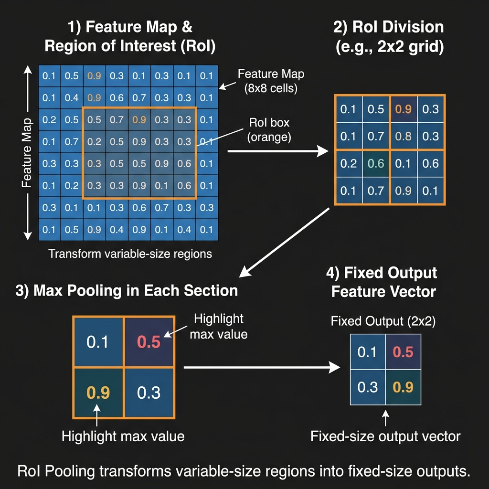

**How RoI Pooling works:**

**Step 1:** Map the proposal coordinates onto the feature map

**Step 2:** Divide the mapped region into a fixed grid (e.g., 7×7)

**Step 3:** Max-pool within each grid cell

**Step 4:** Output: always 7×7 regardless of input size!

**Concrete example:**

**Given:** Feature map 32×32, proposal maps to region (3, 5) → (17, 19) = 14×14 area

**Target:** 7×7 output

$$\text{Bin size} = \frac{14}{7} \times \frac{14}{7} = 2 \times 2 \text{ per bin}$$

**Each 2×2 sub-region → max pool → 1 value**

$$7 \times 7 = 49 \text{ values (fixed!)}$$

<!-- pencil -->
↳ الـ RoI Pooling بيحل مشكلة الأحجام المختلفة. زي ما تاخد صورة كبيرة وتصغرها، بس بطريقة ذكية — بتاخد أهم قيمة (max) من كل منطقة.

---

### Fast R-CNN: Multi-Task Loss

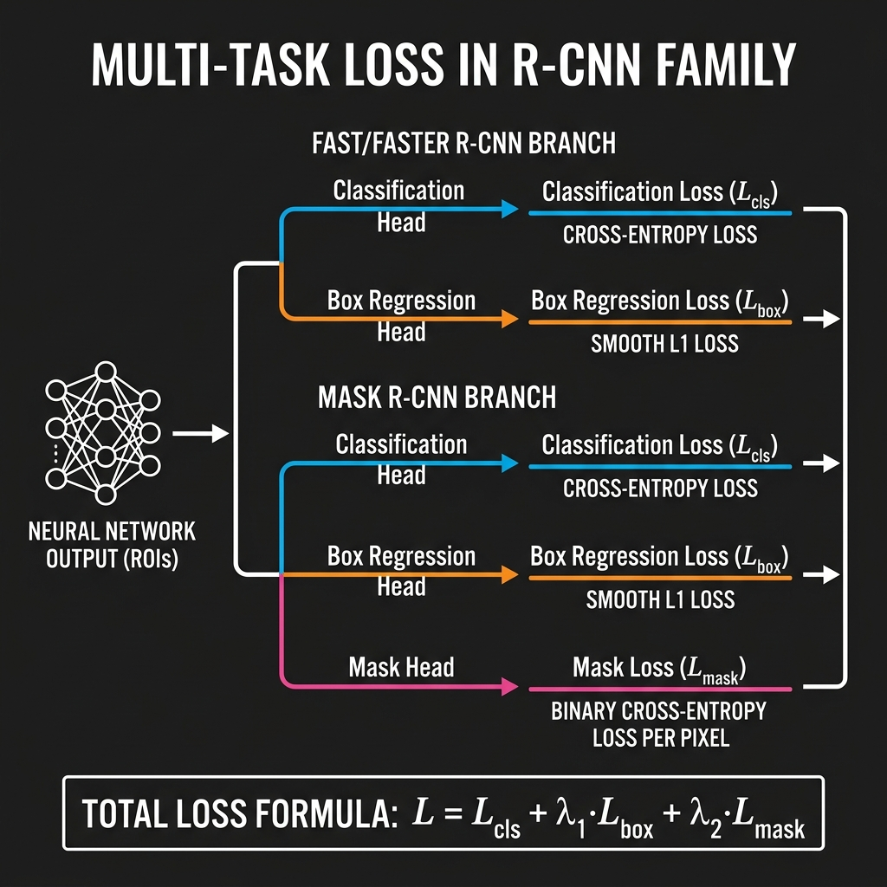

**Unlike R-CNN** (separate SVM + regressor), Fast R-CNN trains **everything together:**

$$\mathcal{L} = \mathcal{L}_{\text{cls}} + \lambda \cdot \mathcal{L}_{\text{box}}$$

**Classification loss** (softmax cross-entropy):

$$\mathcal{L}_{\text{cls}} = -\log p_{\text{true class}}$$

**Box regression loss** (Smooth L1):

$$\mathcal{L}_{\text{box}} = \text{smooth}_{L_1}(t - t^*)$$

$$\text{smooth}_{L_1}(x) = \begin{cases} 0.5x^2 & \text{if } |x| < 1 \\ |x| - 0.5 & \text{otherwise} \end{cases}$$

<!-- pencil -->
↳ الـ Smooth L1 loss أحسن من L2 عشان مش بتتأثر بالـ outliers. لو الفرق كبير، بتبقى linear مش quadratic — فالـ gradient مش بينفجر.

<!-- green -->
**Result:** Fast R-CNN is ~20× faster than R-CNN for training, ~10× faster for inference ✅

---

### Fast R-CNN Inference Code

```python
import torchvision
from torchvision.models.detection import fasterrcnn_resnet50_fpn

# Load pre-trained Fast/Faster R-CNN
model = torchvision.models.detection.fasterrcnn_resnet50_fpn(pretrained=True)
model.eval()

# Inference
predictions = model([image_tensor])
boxes = predictions[0]['boxes']      # (N, 4) bounding boxes
labels = predictions[0]['labels']    # (N,) class indices
scores = predictions[0]['scores']    # (N,) confidence scores
```

**Line-by-line breakdown:**

`fasterrcnn_resnet50_fpn(pretrained=True)` → Load a Faster R-CNN with ResNet-50 backbone + Feature Pyramid Network

`model.eval()` → Switch to inference mode (disable dropout, batch norm uses running stats)

`model([image_tensor])` → Forward pass: returns list of dicts (one per image in batch)

`predictions[0]['boxes']` → Tensor of shape (N, 4) — each row is [x1, y1, x2, y2]

`predictions[0]['scores']` → Confidence scores — filter by threshold (e.g., > 0.5)

<!-- pencil -->
↳ في PyTorch، الـ detection models بترجع dictionary فيه boxes و labels و scores. بتفلتر بالـ score threshold — عادة 0.5 أو 0.7.

---

---
<br><br><br><br><br><br>

## Part 4 — Faster R-CNN: Learning Where to Look

### The Remaining Bottleneck

Fast R-CNN made the CNN fast. But **Selective Search is still slow!**

$$\text{Selective Search} \approx 2 \text{ seconds per image (CPU)}$$

**That's 87% of total inference time!** 😱

<!-- pencil -->
↳ بعد ما حلينا مشكلة الـ CNN المتكرر، اكتشفنا إن الـ bottleneck الجديد هو Selective Search نفسه. الحل؟ خلّي الـ network نفسها تقترح الـ regions!

---

### Region Proposal Network (RPN) — The Game Changer

**Idea:** Replace handcrafted Selective Search with a **small neural network** that proposes regions.

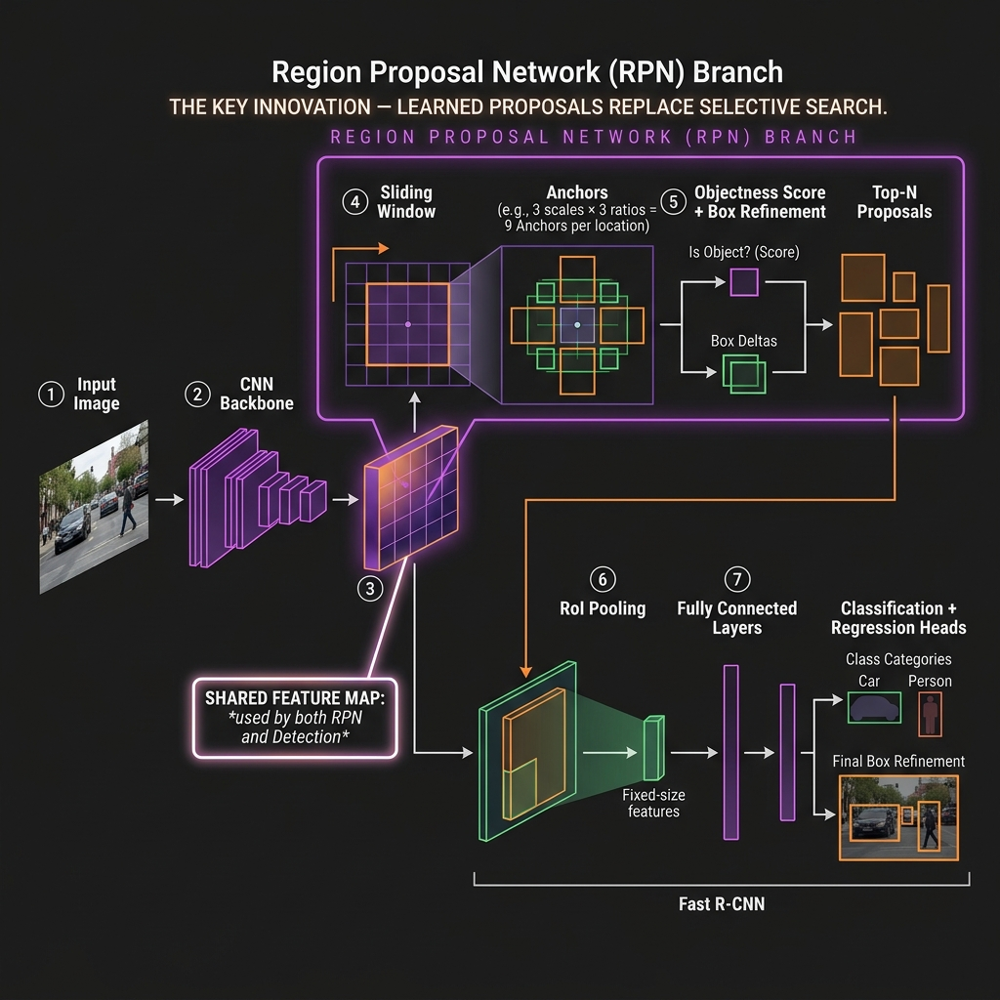

**The RPN slides a 3×3 window** over the shared feature map:

**At each position**, it predicts:

**Objectness scores:** Is there an object here? (2 values: object vs background)

**Box refinements:** How to adjust the anchor? (4 values: $\Delta x, \Delta y, \Delta w, \Delta h$)

---

### Anchors in the RPN

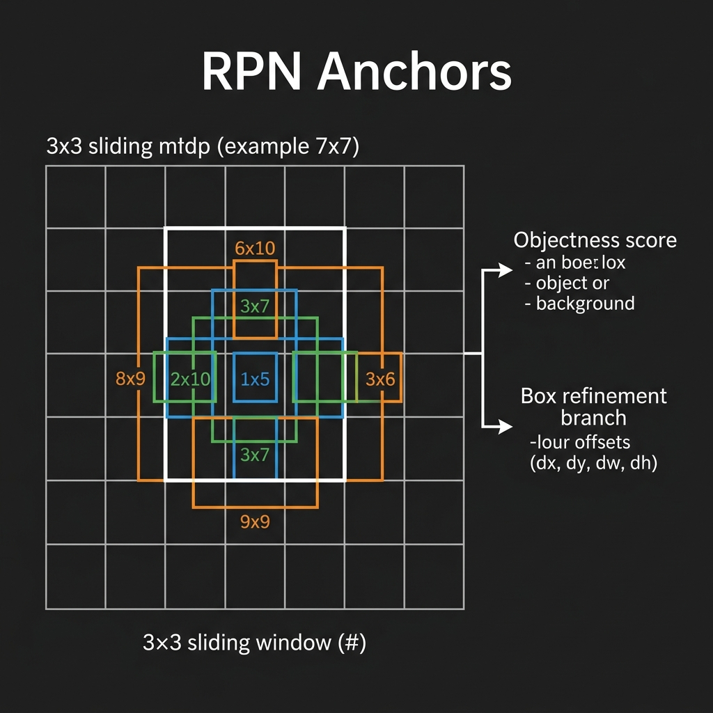

**At each feature map location**, the RPN places $k$ anchor boxes:

**3 scales:** $128^2$, $256^2$, $512^2$ pixels

**3 aspect ratios:** 1:1, 1:2, 2:1

$$k = 3 \times 3 = 9 \text{ anchors per location}$$

**For a feature map of size $W \times H$:**

$$\text{Total anchors} = W \times H \times k$$

**Concrete example:**

**Feature map:** $40 \times 60$ (from 600×1000 input)

$$\text{Total anchors} = 40 \times 60 \times 9 = 21{,}600$$

**After NMS:** ~300 proposals (vs 2000 from Selective Search!)

<!-- pencil -->
↳ الـ anchors زي الشباك اللي بترميها في البحر — بترمي 21,600 شبكة وبتشيل أحسن 300 واحدة. الفرق إن ده بيحصل بـ GPU في milliseconds مش بـ CPU في ثواني.

---

### RPN Training — Positive and Negative Anchors

**How do we train the RPN to propose good regions?**

**Positive anchor** (label = 1): IoU with any ground-truth box ≥ 0.7

**Negative anchor** (label = 0): IoU with ALL ground-truth boxes < 0.3

**Ignored:** IoU between 0.3 and 0.7 (ambiguous)

**RPN loss:**

$$\mathcal{L}_{\text{RPN}} = \frac{1}{N_{\text{cls}}} \sum_i \mathcal{L}_{\text{cls}}(p_i, p_i^*) + \lambda \frac{1}{N_{\text{reg}}} \sum_i p_i^* \cdot \mathcal{L}_{\text{reg}}(t_i, t_i^*)$$

**Note:** $p_i^* \cdot \mathcal{L}_{\text{reg}}$ means regression loss is **only computed for positive anchors** (no point refining a box around nothing!)

<!-- pencil -->
↳ الـ $p_i^*$ ده mask — لو الـ anchor positive (فيه object)، بنحسب الـ regression loss. لو negative (خلفية)، مفيش داعي نعدل الـ box عشان مفيش حاجة أصلاً.

---

### Faster R-CNN: Shared Features

**The genius of Faster R-CNN:** The RPN and the detection head **share the same CNN backbone!**

$$\text{Image} \xrightarrow{\text{CNN}} \text{Shared Feature Map} \begin{cases} \xrightarrow{\text{RPN}} \text{Proposals} \\ \xrightarrow{\text{RoI Pool}} \text{Classification + Regression} \end{cases}$$

**No extra computation for proposals!** The RPN is just a small 3×3 conv layer on top of the existing feature map.

<!-- green -->
**Result:** Faster R-CNN runs at ~5 FPS on GPU — 10× faster than Fast R-CNN, 200× faster than R-CNN! ✅

---

---
<br><br><br><br><br><br>

## Part 5 — Mask R-CNN: Beyond Boxes

### From Detection to Instance Segmentation

**Object detection** tells you WHERE (bounding box) and WHAT (class).

**Instance segmentation** adds HOW — the exact pixel-level shape of each object.

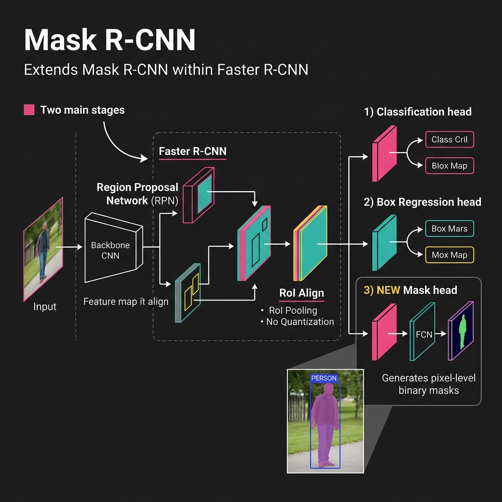

**Mask R-CNN = Faster R-CNN + Mask Branch**

For each proposed region, it predicts:

**Class label** (what)

**Bounding box** (where)

**Binary mask** (exact shape — pixel by pixel!)

<!-- pencil -->
↳ الـ Mask R-CNN بيقولك مش بس "فيه عربية في المكان ده" — لأ، بيقولك بالظبط "البكسلات دي هي العربية". ده مفيد جداً في الـ self-driving cars والـ medical imaging.

---

### RoI Align — Fixing Quantization

**Problem with RoI Pooling:** Quantization loses spatial precision!

**Example:** Proposal maps to coordinates (3.4, 5.7) on feature map → RoI Pooling rounds to (3, 6) → **misalignment!**

**RoI Align** uses **bilinear interpolation** instead of rounding:

$$f(x, y) = \sum_{i,j} w_{ij} \cdot f(x_i, y_j)$$

where $w_{ij}$ are the bilinear interpolation weights.

**For masks, this matters a lot** — a 1-pixel shift can ruin the mask!

<!-- pencil -->
↳ الفرق بين RoI Pooling و RoI Align: الأول بيقرّب الأرقام (rounding) فبيحصل shift. التاني بيستخدم interpolation فبيحافظ على الدقة. للـ bounding boxes مش فارقة كتير، بس للـ masks فارقة جداً.

---

### Mask Branch — How It Works

**For each RoI, the mask branch outputs:**

$$\text{Mask} \in \mathbb{R}^{K \times m \times m}$$

where $K$ = number of classes, $m$ = mask resolution (typically 28)

**That means:** For each class, it predicts a 28×28 binary mask.

**At inference:** Use the classification head to pick the class → use that class's mask.

**Mask loss** (only for positive RoIs):

$$\mathcal{L}_{\text{mask}} = -\frac{1}{m^2} \sum_{i,j} \left[ y_{ij} \log \hat{y}_{ij} + (1 - y_{ij}) \log(1 - \hat{y}_{ij}) \right]$$

This is per-pixel binary cross-entropy — treating each pixel as independent!

<!-- pencil -->
↳ كل class ليها mask لوحدها — مفيش competition بين الـ classes على مستوى الـ pixels. ده design choice مهم عشان بيخلي الـ mask quality أحسن.

---

### Total Mask R-CNN Loss

$$\mathcal{L} = \mathcal{L}_{\text{cls}} + \mathcal{L}_{\text{box}} + \mathcal{L}_{\text{mask}}$$

**The beauty:** Adding the mask branch **doesn't hurt** box detection accuracy — each task helps the shared features learn better!

<!-- green -->
**Result:** Mask R-CNN achieves state-of-the-art on COCO instance segmentation while maintaining Faster R-CNN's detection quality ✅

---

---
<br><br><br><br><br><br>

## Part 6 — Speed & Accuracy: The Full Comparison

### Inference Speed Evolution

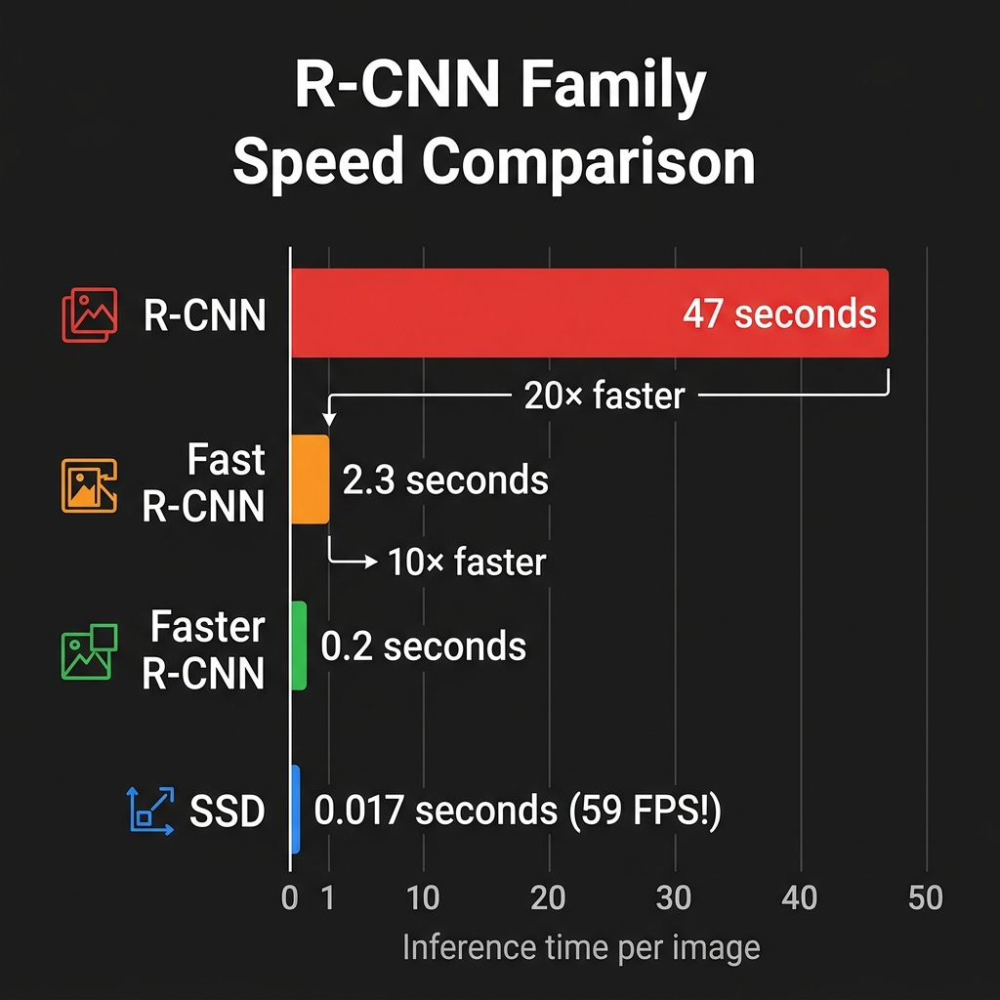

| Model | Proposals | CNN Passes | Time/Image | FPS |
|-------|-----------|-----------|------------|-----|
| **R-CNN** | Selective Search (~2000) | 2000 | 47s | 0.02 |
| **Fast R-CNN** | Selective Search (~2000) | **1** | 2.3s | 0.4 |
| **Faster R-CNN** | **RPN** (~300) | **1** | 0.2s | 5 |
| **SSD** | None (anchor-based) | **1** | 0.017s | **59** |

<!-- pencil -->
↳ لاحظ إن كل تحسين بيحل bottleneck واحد: R-CNN→Fast = CNN مرة واحدة. Fast→Faster = شيل Selective Search. Faster→SSD = شيل الـ two stages خالص.

---

### Accuracy Comparison (COCO mAP)

| Model | mAP@0.5 | mAP@[0.5:0.95] | Best For |
|-------|---------|-----------------|----------|
| **R-CNN** | ~58% | — | Historical reference |
| **Fast R-CNN** | ~68% | — | Improved training |
| **Faster R-CNN** | ~73% | ~42% | High accuracy needed |
| **Mask R-CNN** | ~75% | ~45% | Segmentation + detection |
| **SSD** | ~74% | ~41% | Real-time applications |

<!-- pencil -->
↳ الـ mAP@[0.5:0.95] هو المقياس الأصعب — بيختبر الدقة عند IoU thresholds مختلفة. Faster R-CNN و SSD متقاربين في الدقة، بس SSD أسرع بكتير.

> **Key insight:** The accuracy gap between two-stage and one-stage detectors has narrowed significantly. The choice is now about trade-offs: speed vs accuracy vs capabilities (segmentation).

---

### When to Use What?

**Need real-time detection?** → SSD or YOLO ⚡

**Need highest box accuracy?** → Faster R-CNN 🎯

**Need pixel-level masks?** → Mask R-CNN 🎭

**Need to understand the history?** → Study R-CNN first, then build up! 📚

---

### Key Formulas to Remember

**IoU (Intersection over Union):**

$$\text{IoU} = \frac{|A \cap B|}{|A \cup B|}$$

**Multi-Task Loss (Fast/Faster R-CNN):**

$$\mathcal{L} = \mathcal{L}_{\text{cls}} + \lambda \cdot \mathcal{L}_{\text{box}}$$

**Mask R-CNN Loss:**

$$\mathcal{L} = \mathcal{L}_{\text{cls}} + \mathcal{L}_{\text{box}} + \mathcal{L}_{\text{mask}}$$

**Total Anchors (Faster R-CNN RPN):**

$$\text{Anchors} = W \times H \times k$$

**Smooth L1 Loss:**

$$\text{smooth}_{L_1}(x) = \begin{cases} 0.5x^2 & |x| < 1 \\ |x| - 0.5 & \text{otherwise} \end{cases}$$

<!-- pencil -->
↳ كده خلصنا الـ R-CNN Family كلها! من R-CNN البطيء (47 ثانية) لـ Faster R-CNN السريع (0.2 ثانية) لـ Mask R-CNN اللي بيعمل segmentation. كل واحد بنى على اللي قبله وحل مشكلة واحدة.
